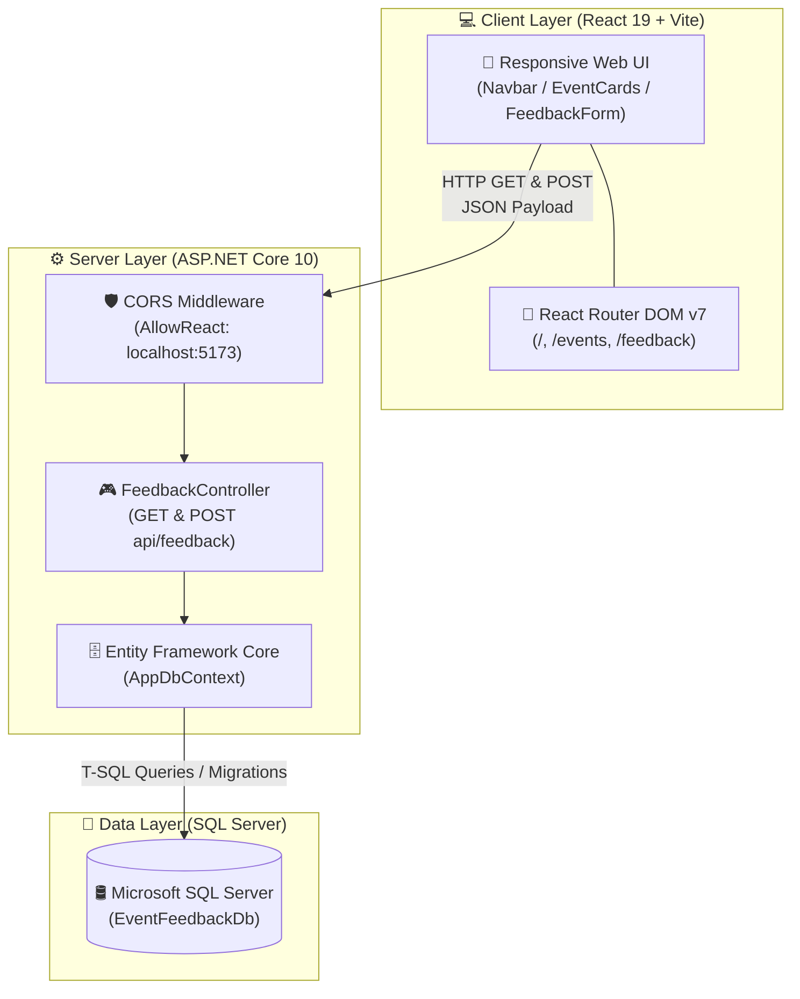

<div align="center">

# 🌟 Event Feedback Management System

[](https://react.dev/)
[](https://vitejs.dev/)
[](https://dotnet.microsoft.com/)
[](https://learn.microsoft.com/en-us/dotnet/csharp/)
[](https://learn.microsoft.com/en-us/ef/core/)
[](https://www.microsoft.com/en-us/sql-server)
[]()

<br />

> 💬 **A modern, full-stack event review and attendee insights platform.**  
> Developed as an internship project at **Sysslan IT Solutions**.

<br />

[Explore Features](#-key-features) •
[Architecture](#-system-architecture) •
[Tech Stack](#-technology-stack) •
[API Reference](#-api-endpoints) •
[Quick Start](#-getting-started) •
[Author](#-author)

---

</div>

## 📖 Table of Contents

- [🌟 Overview](#-overview)
- [✨ Key Features](#-key-features)
- [🏗️ System Architecture](#-system-architecture)
- [🛠️ Technology Stack](#-technology-stack)
- [📡 API Endpoints](#-api-endpoints)
- [📂 Project Structure](#-project-structure)
- [🎓 Internship Milestones](#-internship-milestones-completed)
- [🚀 Getting Started](#-getting-started)
  - [Prerequisites](#prerequisites)
  - [Backend Setup (.NET)](#1-backend-setup-aspnet-core)
  - [Frontend Setup (React + Vite)](#2-frontend-setup-react--vite)
- [👤 Author](#-author)

---

## 🌟 Overview

The **Event Feedback Management System** is a responsive web application designed to collect, validate, and store attendee sentiment and feedback for tech conferences, bootcamps, and workshops.

### 🎯 Primary Capabilities:
- 📝 **Interactive Feedback Collection**: Attendees can select an event, rate their experience (1–5 scale), and provide detailed feedback.
- ⚡ **Real-Time Data Persistence**: Submissions are transmitted via RESTful API calls and stored in Microsoft SQL Server using Entity Framework Core.
- 📊 **Feedback Insights Display**: Previously submitted reviews are fetched and dynamically rendered in clean UI cards.

---

## ✨ Key Features

| Category | Feature | Description |
|---|---|---|
| 📋 **Form Handling** | **Live Form Validation** | Real-time checks for required fields, character limits, and valid email format. |
| ⭐ **Attendee Ratings** | **1 to 5 Star Rating** | Intuitive rating selection representing attendee satisfaction levels. |
| 🔄 **State Management** | **Pre-Selected Event Routing** | Clicking *"Give Feedback"* on any event card automatically prefills the event in the form. |
| 🌐 **REST Integration** | **Asynchronous Communication** | Smooth `fetch` calls connecting React UI to ASP.NET Core endpoints. |
| 🛡️ **Cross-Origin Security** | **Configured CORS Policy** | Restricts API access specifically to authorized frontend clients. |
| 📱 **Responsive UI** | **Mobile-First Layout** | Crafted with modern CSS Grid, Flexbox, glassmorphism headers, and responsive media queries. |

---

## 🏗️ System Architecture



---

## 🛠️ Technology Stack

<div align="center">

| Area | Technologies |
|---|---|
| **Frontend** |     |
| **Backend** |    |
| **ORM & Database** |   |
| **Tooling** |    |

</div>

---

## 📡 API Endpoints

Base URL: `http://localhost:5216/api/feedback`

### 1. Retrieve All Feedbacks
- **Method**: `GET`
- **Endpoint**: `/api/feedback`
- **Description**: Fetches all submitted feedback records stored in SQL Server.
- **Sample Response** (`200 OK`):
```json
[
  {
    "id": 1,
    "fullName": "Jane Doe",
    "email": "jane@example.com",
    "event": "AI & Machine Learning Workshop",
    "rating": 5,
    "comments": "Inspiring session with great hands-on practical examples!"
  }
]
```

### 2. Submit New Feedback
- **Method**: `POST`
- **Endpoint**: `/api/feedback`
- **Headers**: `Content-Type: application/json`
- **Payload**:
```json
{
  "fullName": "Jane Doe",
  "email": "jane@example.com",
  "event": "AI & Machine Learning Workshop",
  "rating": 5,
  "comments": "Inspiring session with great hands-on practical examples!"
}
```
- **Response** (`200 OK` / `201 Created`):
```json
{
  "id": 1,
  "fullName": "Jane Doe",
  "email": "jane@example.com",
  "event": "AI & Machine Learning Workshop",
  "rating": 5,
  "comments": "Inspiring session with great hands-on practical examples!"
}
```

---

## 📂 Project Structure

```text
Event-Feedback-Management-System/
│
├── 📁 frontend/                         # React 19 + Vite Client
│   ├── 📁 public/                       # Static icons and assets
│   ├── 📁 src/
│   │   ├── 📁 assets/                   # Images and vectors
│   │   ├── 📁 components/               # Navbar, EventCard, Footer
│   │   ├── 📁 pages/                    # Home, Events, Feedback
│   │   ├── 📄 App.jsx                   # App shell & router declaration
│   │   ├── 📄 App.css                   # Component & responsive styles
│   │   └── 📄 index.css                 # Base theme variables & reset
│   ├── 📄 package.json                  # Frontend dependencies
│   └── 📄 vite.config.js                # Vite build config
│
├── 📁 backend-dotnet/                   # ASP.NET Core 10 Web API
│   ├── 📁 Controllers/
│   │   └── 📄 FeedbackController.cs     # REST API route handlers
│   ├── 📁 Data/
│   │   └── 📄 AppDbContext.cs           # Entity Framework DbContext
│   ├── 📁 Models/
│   │   └── 📄 Feedback.cs               # Feedback entity model
│   ├── 📁 Migrations/                   # EF Core SQL Server migrations
│   ├── 📄 Program.cs                    # Application bootstrapping & middleware
│   ├── 📄 appsettings.json              # Connection string & configuration
│   └── 📄 backend-dotnet.csproj         # .NET package references
│
├── 📄 .gitignore                        # Git exclusion rules
└── 📄 README.md                         # Project documentation
```

---

## 🎓 Internship Milestones Completed

> **Sysslan IT Solutions — Full-Stack Web Development Track**

- [x] **Level 3 - Database Basics**:
  - Configured Microsoft SQL Server connection with `AppDbContext`.
  - Defined `Feedback` model and generated Initial EF Core migrations.
  - Verified persistence and query retrieval.
- [x] **Level 4 - Full-Stack Integration**:
  - Established cross-origin REST communication with ASP.NET Core CORS policy.
  - Implemented client form with email regex validation and error states.
  - Built asynchronous submission flow and success alerts.
- [x] **Level 5 - UI Polish & Experience Review**:
  - Enhanced accessibility, button states, and modern glassmorphic theme.
  - Dynamic routing with state passing from event cards to the feedback form.
  - Comprehensive end-to-end testing of the feedback lifecycle.

---

## 🚀 Getting Started

### Prerequisites

Ensure you have the following installed:
- [Node.js](https://nodejs.org/) (v18 or higher)
- [.NET 10 SDK](https://dotnet.microsoft.com/download)
- [Microsoft SQL Server](https://www.microsoft.com/en-us/sql-server) (or SQL Server Express)

---

### 1. Backend Setup (ASP.NET Core)

1. Open a terminal and navigate to the backend folder:
   ```bash
   cd backend-dotnet
   ```

2. Verify or update the SQL Server connection string in `appsettings.json`:
   ```json
   "ConnectionStrings": {
     "DefaultConnection": "Server=localhost\\SQLEXPRESS;Database=EventFeedbackDb;Trusted_Connection=True;TrustServerCertificate=True;"
   }
   ```

3. Restore packages and apply database migrations:
   ```bash
   dotnet restore
   dotnet ef database update
   ```

4. Run the API server:
   ```bash
   dotnet run
   ```
   > 🚀 Backend will be listening on `http://localhost:5216`.

---

### 2. Frontend Setup (React + Vite)

1. In a separate terminal, navigate to the frontend folder:
   ```bash
   cd frontend
   ```

2. Install dependencies:
   ```bash
   npm install
   ```

3. Launch the development server:
   ```bash
   npm run dev
   ```
   > 🌐 Open your browser and navigate to `http://localhost:5173`.

---

## 👤 Author

**Bushra Sayyed**  
- GitHub: [@sayyedbush2003-ops](https://github.com/sayyedbush2003-ops)
- Project: Event Feedback Management System (Sysslan IT Solutions)

---

<div align="center">

*If you found this project helpful, feel free to give it a ⭐ on GitHub!*

</div>
